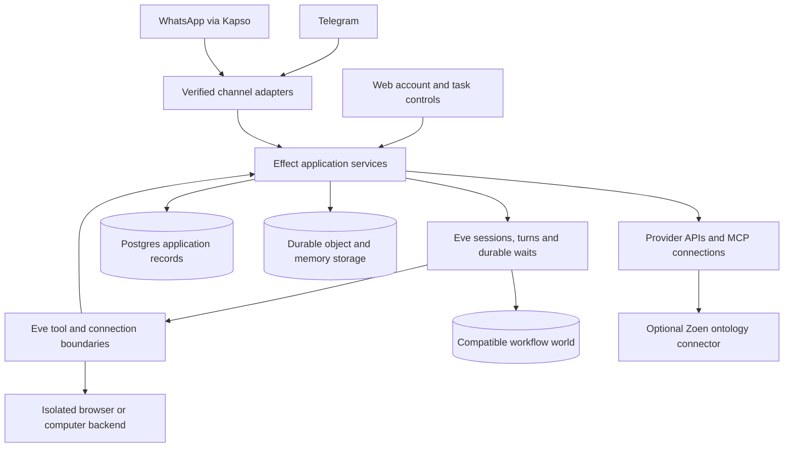

# Companion: product, architecture and execution blueprint

Status: proposed target and ordered implementation plan, 2026-09-08.
Baseline: private OpenInstinct copy at upstream `5fb62c4`, assessment `bbb582c`,
Effect foundation `cdd7999`. This document describes work to do, not implemented
capabilities. It supersedes conflicting recommendations in the initial assessment;
that assessment remains the record of the inspected baseline and checks.

## Product promise

**Send it something you need handled. Trust it to follow through.**

The [product direction](product-direction.md) applies the final focus and experience
review to this architecture. It governs launch presentation, coherent defaults,
end-to-end journeys and what to defer; it does not waive correctness gates.

The subsequent [conversation experience](conversation-experience.md) and
[native onboarding contract](native-onboarding.md), confirmed on 2026-09-08,
refine this direction: conversation is primary, with optional native buttons or
cards when they reduce effort. Natural responses and controls resolve the same
exact pending action. No visible approval codes or tool JSON; neither input path
weakens ownership, current authorization or effect verification.

A capable personal assistant in the conversations people already use. It remembers
what matters, acts through their existing tools, follows through over time, and
makes both its actions and its limits understandable. WhatsApp through Kapso and
Telegram are equal product destinations; Telegram is the first validation channel.
The service can support many users and can be operated outside Vercel.

The long-term experience includes voice, files, useful proactive assistance,
connected applications, browser and computer work, user-installed MCPs/CLIs,
multiple model/execution options and the optional Zoen ontology connector.
The implementation remains generic. Personal, professional and household journeys
are evaluation scenarios, not different agent implementations.

Ambition is measured by completed user outcomes. Elegance means each fact has one
owner, each action follows the same checks, and adding a channel or integration
requires an adapter rather than another product backend.

## Product journeys and acceptance

| Journey                  | Intended experience                                                                                            | Evidence that it works                                                                                                                                   |
| ------------------------ | -------------------------------------------------------------------------------------------------------------- | -------------------------------------------------------------------------------------------------------------------------------------------------------- |
| First contact            | Message the assistant, receive a useful response immediately, learn how to connect tools only when useful      | Private chat works without web registration, a phone requirement on Telegram, or a browser-provider credential; abuse limits apply before expensive work |
| Connect an account       | Open a short-lived link, see the account and scopes, consent, return to the same conversation                  | Wrong-user callback, expired/reused challenge and concurrent linking are rejected; restart does not lose the pending connection                          |
| Delegate an action       | State an outcome; assistant gathers context, resolves material ambiguity and executes within granted authority | Reads do not cause needless approval prompts; changes outside the mandate get an exact preview; the result is verified against the provider              |
| Continue naturally       | Send several fragments, a correction, a voice note, a document or a follow-up while work runs                  | Accepted input is retained and ordered; corrections steer deliberately; cancellation does not claim to undo completed work                               |
| Remember and correct     | Ask it to remember a preference, ask why it knows something, correct or forget it                              | Memory identifies its source; corrections affect retrieval; deleted information is not silently reconstructed from retained summaries                    |
| Follow through           | Set reminders, recurring tasks or event-based watches; receive concise useful follow-ups                       | Restart, delayed callbacks, time zones, quiet hours and opt-out work; repeated observations do not create repeated notifications                         |
| Cross channels           | Link Telegram and WhatsApp, use the same account, choose where results arrive                                  | Verified linking shares permitted memory and integrations; conversations remain distinct; no automatic mirroring or secret leakage                       |
| Recover from uncertainty | Ask what happened after a provider timeout or interrupted task                                                 | Shows confirmed success, failure or unresolved outcome accurately; never reports a tool proposal as completed work                                       |
| Work on the computer     | Delegate a task that has no adequate API                                                                       | Isolated user workspace, scoped credentials, bounded execution, recoverable files and a clear result; another user cannot access the session             |
| Control the service      | Inspect tasks, connected accounts, memory, permissions and usage; disconnect or delete                         | Web controls and chat commands use the same services; revocation stops future use; exports/deletion have observable completion                           |

The web application is a companion to chat: onboarding links, consent, connections,
task details, memory controls, files and usage. Preserve useful existing web chat,
but messaging must not depend on a user learning a separate dashboard.

## Architecture: one application, clear owners

Arrows describe calls, not permission escalation. Framework callbacks invoke
application operations; application services never recursively start another
agent loop. All routes/tools resolve the current actor and grant before accessing
private data or dispatching work.

| Responsibility                                                                                      | Single owner                                       | Boundary                                                                                       |
| --------------------------------------------------------------------------------------------------- | -------------------------------------------------- | ---------------------------------------------------------------------------------------------- |
| Agent loop, session history, turn checkpointing, durable HITL waits                                 | Eve                                                | App stores references and necessary product projections, not a second replay engine            |
| Business logic, policies, validation, errors, resource lifetime, bounded concurrency and telemetry  | Effect services and Layers                         | Narrow framework bridges; Promise-returning SDKs remain inside adapters                        |
| Account/session authentication                                                                      | Better Auth plus verified channel identity service | Web cookies, provider webhooks and internal service requests are different credentials         |
| Product facts: grants, accepted delivery records, action intent/results, schedules, memory metadata | Application Postgres records                       | Own the provider inbox/outbox and action facts; no duplicate Eve event journal                 |
| Durable workflow storage/queue/hooks                                                                | One compatible Workflow world                      | A Postgres implementation is the preferred spike; local disk world is not multi-instance proof |
| Provider credentials and refresh                                                                    | Connection service                                 | Tokens stay outside prompts, model-controlled compute and ordinary logs                        |
| Browser/terminal/filesystem isolation                                                               | Selected sandbox backend                           | The sandbox is an execution resource, not the authority for grants or outcomes                 |
| Business semantics inside Zoen                                                                      | Zoen connector                                     | No imported ontology engine or shared authority database                                       |

Target the smallest operational topology: Next web plus the required Eve Node
runtime, Postgres and object storage. These may need two application processes;
package 1 decides the supported `withEve`/Nitro deployment and callback routing.
Use one image with explicit process roles where supported. Do not split business
capabilities into microservices. Add Redis only if the chosen durable Chat SDK
state adapter requires it and it measurably simplifies the qualified stack.

## Effect everywhere in owned logic

Use the installed Effect 4 APIs as the reference. The target is an Effect
application integrated with Eve, not a layer of wrappers around unchanged business
logic and not a fork of the framework's internals.

- `Schema` owns domain validation, identifiers, commands and typed errors. Derive
  boundary contracts where supported; if Eve/AI SDK requires another schema shape,
  adapt once at the edge and test equivalence. Verify supported Standard Schema /
  JSON Schema paths before choosing conversion. Do not hand-maintain two models.
- `Context.Service` and `Layer` define real services and infrastructure ownership.
  Create services at I/O or policy boundaries, not for every pure function.
- `Effect.fn`, typed failure channels and scoped resources replace ad hoc Promise
  orchestration. Distinguish invalid input, denied, missing, conflicting, expired,
  unavailable and uncertain outcomes. Defects remain diagnosable defects.
- A lifecycle-owned `ManagedRuntime` bridges each host's framework callbacks.
  Share layers inside a process; dispose at shutdown; pass request cancellation
  only to work whose lifetime should end with that request. Accepted durable work
  survives a webhook connection closing.
- Use Effect HttpClient for owned HTTP integration code. Use Effect SQL for new
  and migrated owned domain persistence, with one transaction boundary per action.
  Existing Drizzle access is replaced domain by domain with all callers/tests;
  Better Auth may retain its supported Drizzle adapter for its own tables. Do not
  create two writers for the same domain or rewrite auth internals for uniformity.
- Keep one coordinated migration history across auth/application changes. There
  is no requirement to preserve disposable development data, but applied migration
  rewrites require an explicit reset plan. Do not silently change the baseline.
- Prefer Effect HttpApi for new owned APIs. Migrate existing tRPC routes in complete
  feature slices, including web callers. Keep Eve's routes and protocols intact.
- Effect manages in-process retries/concurrency. Eve and its world own durable
  execution. An Effect fiber, Ref, Queue or PubSub is never evidence of durable
  acceptance, distributed locking or restart recovery. Initialize Effect at the
  supported app/step boundary, never serialize runtimes/layers/fibers into workflow
  checkpoints. Keep workflow bodies deterministic; prove completed-step replay,
  interrupted-step recovery and cancellation. Give each failure one retry owner
  across SDK, Effect and workflow layers. Qualify code moves/upgrades with active
  workflows because path-derived workflow identity can change.
- React rendering remains React. Browser-side validation/application logic can use
  Effect; server secrets and server layers never enter the client bundle.
- Keep one compiler/toolchain policy. Adopt TS7 for owned code after a frozen
  compatibility check with Next/Eve; use Oxfmt/Oxlint, Effect-aware linting where
  compatible, and a version-matched test integration. Do not override peer ranges
  or install a second compiler simply to suppress errors.

Migration completion means no owned domain service remains an independent Promise
implementation, no duplicate schemas are maintained, and runtime execution occurs
only at declared integration edges. SDK internals and React rendering are explicit
boundaries. Adding `effect` alone does not meet that definition.

## Identity, account linking and authority

A new verified private sender receives a minimal internal account and conversation
without a mandatory web signup. This is not an unverified browser login. Web access
requires a one-use challenge completed through the linked channel or another
explicitly configured authentication method. Rate-limit account creation and
model usage, and support account recovery without trusting an arbitrary new sender.

Channel identity is `(installation, provider, external sender ID)`, not a display
name. A Telegram user ID must not be replaced by an optional phone number; a
WhatsApp number is not proof that two pre-existing accounts should merge.

Linking requires fresh proof of both sides, an expiry, one-use consumption and an
atomic conflict check. If both identities already own data, present an explicit
merge decision and transfer policy; do not merge silently. Ship safe refusal of
conflicting links before implementing account merging. Unlinking revokes that
channel's sessions, pending approvals and delivery permission according to a
specified policy. Recovery cannot bypass the same ownership checks.

Keep private workspaces initially. Later household/team sharing is an explicit
membership/grant feature with separate memory visibility and audit, never a
special-case prompt. Group-chat support has its own sender/membership/approval
model and remains disabled until those properties are proved.

For each operation, authorization considers actor, workspace, resource, grant,
operation, destination and current policy. Ownership is resolved by trusted server
context, not model-provided IDs. A schedule is a bounded delegation from a user;
the fact that a runtime worker invokes it does not create blanket permission.

## Messaging and conversation semantics

Keep Telegram's native Eve channel as the first candidate. For Kapso, evaluate
`@kapso/chat-adapter` through `eve/channels/chat-sdk` before custom transport code.
Kapso documents this adapter; npm metadata inspected on this date reports MIT,
version 0.1.1 and `chat: ^4.29.0`, encompassing the fork's 4.34.0. This is declared
compatibility only, not a runtime qualification. [Kapso integration reference](https://docs.kapso.ai/docs/whatsapp/personal-agent).

Telegram and WhatsApp share acceptance, identity, command routing, tools, memory,
schedules and result semantics. They retain their own verified webhook handling,
formatting, chunking, media references, provider IDs, typing/reactions and delivery
status. No app-owned routing identity or secret goes into model-authored arguments.

Define these behaviors before adapters ship:

1. Verify raw request and installation before parsing trusted actor fields. Bound
   payload/media size, event age and supported event types. Acknowledge only after
   the accepted message can be recovered, including the crash after ACK.
2. Deduplicate by provider identity plus stable event ID, retaining enough intent
   to detect changed replays. Preserve causality even when status events arrive
   before acceptance records or messages arrive out of order.
3. Record accepted input independently of model success. Eve's command inbox is
   not a general FIFO queue. Implement a bounded application inbox for provider acceptance and prove its
   recoverable handoff/correlation to Eve. It is a transport journal, not another
   transcript or workflow engine. Keep raw provider event identity: the inspected
   Telegram public parsed update type does not expose the root `update_id`.
4. Prefer queue semantics for ordinary message bursts. Explicit stop/correct/
   change-direction commands may steer or cancel. Preserve every accepted fragment;
   do not let a provider retry masquerade as a new correction. Handle edits and
   deletions as explicit events with an advertised product policy.
5. Separate assistant response, progress update and proactive notification. Keep
   text concise; coalesce updates; provide links/files when useful. Avoid duplicate
   completion posts when tool-result and session-completion hooks both fire.
6. Bind natural-language approvals to an exact pending request, its current
   arguments and authenticated sender. Ambiguous “yes” with multiple plausible
   referents requires clarification. Corrections invalidate the old proposal.
   Optional native buttons resolve the same action through the same checks;
   stale controls cannot authorize an updated proposal. Keep codes and tool JSON
   out of the normal conversation.
7. Track provider acceptance, delivery and read status distinctly. A timeout after
   sending is an uncertain outcome, not permission to blindly resend. Use stable
   idempotency keys where supported and provider lookup when possible. Eve does
   not provide a provider outbox: enqueue durable outgoing intents in application
   Postgres and lease them through the existing schedule mechanism. Direct provider
   sends deliver notifications; `ctx.to(...).send()` would start/resume an agent.
   Authored event handlers replace native handlers for the same event, so retain
   typing/approval/result behavior deliberately when replacing native delivery.
8. Bind proactive targets to the original authorization. No automatic rerouting
   sensitive content to another channel after blocking/unlinking/delivery failure.

Kapso signs raw webhook bodies with HMAC-SHA256. Verification must use the original
bytes, not a parsed-and-reserialized object. [Kapso webhook security](https://docs.kapso.ai/docs/platform/webhooks/security).
WhatsApp templates, messaging windows, opt-in and operator/provider eligibility
are channel activation requirements that must be checked against current rules.
Provider access is an operational prerequisite, not an implementation shortcut.

## External actions and trust

Tools should prefer structured APIs/MCPs over browser interaction when capability,
permission and reliability are equivalent. Do not route a deterministic read
through a model when the user interface can call the same service directly.

An action has a stable identity, normalized intent, authorizing actor/grant,
external target and outcome evidence. A proposed conceptual lifecycle is:
`prepared → awaiting approval (when needed) → dispatching → confirmed | failed |
uncertain`. Cancellation before dispatch prevents dispatch; cancellation after
an external effect requests cessation/reconciliation and does not imply rollback.
Persist only the action facts the framework/provider cannot supply reliably.

Bind any approval to the exact normalized action, recipient/resource, sensitive
parameters, expiry and current grant. Changed arguments require a new decision.
Existing explicit instructions/mandates should avoid needless repeat questions;
reads within an existing grant are normally automatic. Sending messages, changing
records or spending money follows the operation's granted authority, not a blanket
“always ask” or “never ask” policy.

Revalidate authorization immediately before dispatch and validate the responder
when an approval arrives. An interrupted Eve step can run again. Approval is not
a substitute for an idempotency key, a durable dispatch record or reconciliation.
Never hold a database transaction open across provider I/O. Record intent/claim,
call the provider outside the transaction, then record the result with fencing.
Unknown outcomes stay visible until resolved.

Build a redacted receipt for the user: what was done, where, when, outcome and a
useful provider link. Keep confidential arguments/tokens out of general telemetry.
The operation may be driven by chat, web or a scheduled task; it uses the same
service and authority rules in each case.

## Memory, attention and proactivity

Separate conversation history (Eve), durable user memory, retrieved source data,
and task/schedule state. Do not store everything in a profile string. Memory needs
source, time, owner, visibility, confidence where inferred, and correction/deletion
semantics. Distinguish stated preferences from inferred facts and stale observations.

Start with scoped structured preferences and searchable notes in Postgres plus
object-backed files where needed. Add embeddings/hybrid search only when retrieval
evals demonstrate a gap. Do not introduce a separate vector database by default.
Retrieval must apply ownership/grants before model context is constructed.

Proactivity is a product policy: explicit reminders, recurring delegated tasks and
opted-in event watches. Each has an owner, purpose, trigger, limits, time zone,
quiet hours, deduplication, delivery target and pause/cancel controls. Budget the
cost of polling and reasoning; prefer source events/deltas when reliable. Suppress
repeated/non-actionable notifications. Explain why a suggestion was sent.

Deletion covers raw source references, derived notes, summaries, embeddings,
attachments and future scheduled use. Define backup retention and legal/operational
exceptions separately; never claim a backup was erased when only online data was.
Deleting a memory must not be immediately undone by re-extracting from old history.
Restore must reconcile a deletion/revocation ledger that is retained independently
of the restored backup before serving traffic or resuming schedules. Prove that a
backup taken before deletion cannot reactivate forgotten memory, revoked grants or
cancelled/deleted work. Define the minimum retained identifiers and their retention
explicitly; do not retain deleted content merely to enforce suppression.

## Multimodal experience and communication

Messaging owns normalized attachments and delivery; the media capability owns
bounded retrieval, content identification, transcription/extraction, artifact
storage and expiry. Preserve attachment source and owner through every derived
transcript or extracted document. Provider URLs/tokens stay out of general logs.

Voice notes and live calls are separate capabilities. For voice notes, qualify a
real transcription provider, supported languages, accents, file limits and cost.
Offer a correctable transcript; clarify ambiguous names, amounts and dates before
acting. Audio replies include a text equivalent. Do not silently drop voice input
because the installed Telegram parser only models photo/document attachments.

Maintain a channel capability matrix covering text, quoted reply, image, document,
voice, audio response, interactive approval, edit, reaction, progress and delivery
status. Each entry is supported, explicitly degraded with a usable alternative, or
unavailable. Never silently truncate a result or promise an unsupported operation.
Longitudinal evals cover concise communication, appropriate initiative, uncertainty,
remembered preferences and correction without invented intimacy or recollection.

## Integrations, computer and extensibility

Start with Calendar, then Gmail and file/document access. Reuse the existing Google
tool behavior while moving credentials behind an Effect connection service. The
service owns consent, scope changes, expiry, refresh coordination, revocation,
reconnect, provider errors and per-user limits. A grant is not just a stored token.
Vercel Connect is optional; it cannot be the required broker for independent hosting.

For remote MCP/OpenAPI, use Eve's native connection mechanisms with our token and
authorization callbacks. Resolve actual callable capability for the current grant;
a marketplace listing is not a usable connection. Pin/review tool schema changes
and re-evaluate permissions on expansion. Prevent SSRF, arbitrary callback URLs
and server-side access to metadata/private network endpoints in user-added URLs.
Allow explicitly configured private connectors through a distinct operator policy.

Local MCP processes and CLIs run in isolated compute. Pin packages/artifacts,
constrain environment/filesystem/network, meter resource use, broker credentials
and terminate/revoke cleanly. User-selected tools still do not get host credentials
or another user's home directory. No npm installation directly in the control
process as an implicit consequence of an agent request.

Browser/computer work is an optional, explicit capability. Retain the existing Kernel
implementation as the preferred first managed-browser adapter while making boot
independent of its key. Qualify it early; do not wait for arbitrary CLI/MCP
execution to provide browser tasks already supported by the fork. Test backend create, write, capture, stop, reopen, delete, cleanup,
concurrent access and cross-user isolation. Distributed leases, not process-local
locks, govern shared compute. Per-session versus per-user workspace persistence is
an explicit product choice; prefer per-session isolation with user-owned durable
files, then add a persistent personal computer profile when qualified.

Rivet/agentOS remains a candidate subject to the adapter lifecycle/protocol issues
recorded in the assessment. Do not downgrade Eve or force incompatible peers to
fit it. Full computer access is not established by a working browser automation.

BYO ChatGPT is a later execution profile, with explicit account/workload isolation,
limits, consent and supported embedding verification. If it uses a runtime that
owns its own loop, choose that loop for the task and correlate its durable task ID;
never run two competing loops over the same task or assume subscription access
means transferable OAuth tokens for all connected apps. The paid API profile must
remain fully usable independently.

Zoen is one connector with scoped discovery/read/action operations. Eve stores
conversation context and external references, not a copy of ontology authority.
Zoen validates its own permissions and returns its own receipts. Payments and
shared/group workspaces come after their own authorization and reconciliation
acceptance suites; neither should require redesigning identity or operations.

## Kernel decision: retain and qualify early

Kernel is the first managed-browser candidate because the fork already integrates
`@onkernel/sdk` and `@onkernel/browser-loop`. This reduces initial integration work
relative to the currently incompatible Rivet/Eve adapter. It is not evidence of
better task success or performance; compare those with actual workloads.

The published Developer plan has no monthly fee and five concurrent browsers;
Hobbyist is $30/month and ten; Start-Up is $200/month and 150. Usage is additional.
[Plan pricing](https://www.kernel.sh/pricing).
Published active rates imply approximately $0.06/hour headless, $0.48/hour headful,
and $2.88/hour headful GPU. Standby is not billed but still occupies concurrency.
10,000 tasks averaging two active headful minutes imply about $160 browser usage,
before credits, plan fees and model/other costs. This is arithmetic, not a measured
task-cost estimate. [Usage and limits](https://www.kernel.sh/docs/info/pricing).

Prefer on-demand allocation initially. Measure real active time: open CDP/live
view activity can keep a browser active. Preserve per-user profile ownership,
controlled login/2FA handoff, retention policy and explicit cleanup. Public pricing
pages disagree about pool availability across plans; confirm entitlement before
making pools a requirement. No account signup or purchase is part of this plan.

Kernel provides browser control and profiles; our Effect services still own
identity, grants, operations, costs and result reconciliation. Kernel Managed Auth
is website-session assistance, not a replacement for all API OAuth grants or
product account authentication. Do not move the companion agent loop into Kernel's
app platform merely because it can host one.

Kernel also publishes Hypeman, the VM manager behind its infrastructure. It runs
container images as VMs, but cross-host scheduling and failover live outside its
single-host scope. Self-hosting Hypeman would still require the browser-service
control plane and operational work. It is not established as a drop-in self-hosted
replacement for Kernel's complete service. [Kernel's Hypeman description](https://www.kernel.sh/blog/hypeman).

Architectural recommendation: self-host the companion core; use Kernel as an
optional managed-browser profile; separately qualify a self-hosted compute profile
when needed. Compare Kernel, Rivet/agentOS and Hypeman only at matching scope and
with real isolation, lifecycle, latency and total operational cost evidence.

## Hosting, security, costs and operations

A self-host installation must be reproducible from a tagged release and documented
configuration, with no Vercel login and no mandatory browser vendor. Self-hosting
refers to the application and required storage/runtime; WhatsApp, Telegram, OAuth
providers and paid model APIs remain external dependencies. A completely offline
or all-local inference profile is a separate capability to qualify.

- Build immutable images, validate configuration per enabled capability, run
  migrations as a controlled job, expose health/readiness and drain on shutdown.
  Do not read live secrets or connect providers merely to compile web pages.
- Route both Eve and workflow callback prefixes correctly. Verify public webhook,
  user route and internal callback authentication separately. Use real service
  authentication outside Vercel; no local privileged identities in production.
- Encrypt secrets with explicit key versioning and rotation; restore data and keys
  together. Scope object access and downloads; bound file processing and verify
  content types. Treat emails, pages, files and tool metadata as untrusted content.
- Cover CSRF/session fixation, linking replay, webhook forgery, tenant escapes,
  prompt injection, unauthorized data exfiltration, secret-bearing logs and
  browser egress with executable tests at the actual boundary.
- Record correlated intake/session/turn/action/provider IDs. Collect latency,
  queue age, retries, unresolved actions, delivery failures and token/sandbox cost.
  Logs are redacted by default, with bounded retention and controlled support access.
- Set per-user and installation budgets for model tokens, tools, sandbox time,
  storage and proactive work. Enforce concurrency/fairness so one user cannot
  starve the service. Reserve budget before expensive work and settle actual use.
- Add operator pause/drain/retry/reconcile controls, dead-letter inspection,
  backup/restore, database growth controls, incident runbooks and upgrade checks.
  An operator retry must respect the same action identity and uncertainty rules.
- Offer self-host quotas first. If selling hosted access, add billing, entitlements,
  usage reconciliation, spending controls and support workflows as a separate
  release capability. Do not claim unlimited usage without a sustainable policy.

## Repository changes and deletion plan

Retain the current single-project layout during migration. Do not first move the
whole tree into an ambitious monorepo. Ownership below is a destination rule, not
an instruction to create empty folders.

| Area                       | Retain                                                                     | Change or remove as its slice lands                                                                                                      |
| -------------------------- | -------------------------------------------------------------------------- | ---------------------------------------------------------------------------------------------------------------------------------------- |
| `agent/`                   | Eve definitions, hooks, channels, useful tools/skills/subagent integration | Thin entry points call Effect services; remove business duplication and Linq-only assumptions                                            |
| `agent/lib/`               | Agent-specific context/instruction/formatting logic                        | Move shared product authority and I/O to its server/domain owner                                                                         |
| `server/` (when consumed)  | New composition and application capability services                        | Organize by identity, messaging, operations, connections, memory and automation; no generic manager/utilities framework                  |
| `db/`                      | One migration chain, auth schema ownership and database evidence           | Migrate owned domain access to Effect SQL; retire replaced Drizzle domain models atomically                                              |
| `shared/`                  | Browser/server contracts actually shared by consumers                      | Effect Schema is the canonical owned domain contract; remove duplicate mirrored types                                                    |
| `app/`, `web/`             | Useful UI primitives, chat/task/account flows                              | Channel-neutral onboarding and connection/memory/usage controls; migrate tRPC feature slices to typed API boundaries                     |
| `evals/`, tests            | Useful upstream cases and trace tools                                      | Add task success, restart, isolation, channel and privacy evidence; distinguish mocks from real provider checks                          |
| root/tooling/CI            | Locked dependency tree and established lint/format habits                  | TS7 compatibility gate; capability-based config/build; enable CI with real profiles and no fake credentials                              |
| patches and Linq artifacts | Preserve while needed by current code                                      | Remove Linq SDK/OTP/copy/artifacts/config/tests after replacements are integrated; remove patches only after proving every hunk obsolete |

Delete superseded implementation and update consumers together. No compatibility
aliases, dual-write/dual-read services or pretend implementations solely to keep
old tests green. Keep upstream license/notices. Track upstream fixes selectively;
our target architecture can diverge without converting every upstream update into
a mass merge. Add packages or separate deployables only for demonstrated consumers
or isolation/lifecycle needs.

## Execution plan

Deliver the [cross-package experience slices](product-direction.md#how-this-changes-execution)
incrementally. The table below describes capability dependencies and final
acceptance, not a waterfall requiring every subsystem to be finished before an
internal conversation can be exercised. Keep scope limitations explicit, and
retain all admission gates before involving real users.

Every package delivers a usable slice, a source change list and an acceptance
record. These are proposed work packages, not finished tickets or date estimates.
The coordinator owns manifests, runtime composition, shared contracts, migrations
and integration order. Parallel workers must have disjoint file ownership; until
then serialize the work. Independent review is required before integration.

| Package                                 | Depends on                                             | Scope and main source seam                                                                                                                    | Acceptance gate                                                                                                                                                                         |
| --------------------------------------- | ------------------------------------------------------ | --------------------------------------------------------------------------------------------------------------------------------------------- | --------------------------------------------------------------------------------------------------------------------------------------------------------------------------------------- |
| P01 Runtime qualification               | Existing Effect foundation                             | Minimal capability configuration, non-Vercel process/proxy setup, compatible workflow and storage adapters, Eve/Effect bridge and patch audit | Real authenticated turn, one stored note and one scheduled probe survive restart; completed/interrupted-step replay, cancellation and upgrades proved; exact host/world versions pinned |
| P02 Effect application foundation       | P01                                                    | First actual ownership service, runtime Layers, Config, SQL connection/transaction boundary, Schema/API strategy, TS7 compatibility and CI    | Effect has a real consumer; Knip/checks green; no eager provider dependency at build; actual HTTP/PG ownership and finalization tests                                                   |
| P03 Accounts and linking                | P02                                                    | Stable account, channel identity, verified linking/recovery, auth/access-scope and web onboarding                                             | Identity service accepts a verified Telegram-shaped sender without phone; expiry/replay/conflict/concurrent link/unlink tested; channel authenticity is separately proved in P08/P09    |
| P04 Durable messaging                   | P03; P01                                               | Provider inbox/outbox, recoverable Eve handoff, continuation lookup, command ordering, reply targets and leases                               | Crash before/after ACK and dispatch; duplicates/changed replays; burst/steer/cancel; ambiguous send; current grant revalidation; no duplicate transcript                                |
| P05 Connections and operation authority | P03; P02                                               | Google OAuth lifecycle, Calendar tools, action-intent/approval/result record and receipts                                                     | Two real grants; refresh/revoke/concurrency; exact approved create/update; interrupted-step and provider-timeout reconciliation                                                         |
| P06 Memory and privacy controls         | P03; P01 storage adapter                               | Structured preferences, durable notes, existing memory providers and artifact authorization                                                   | Scoped recall, source inspection, correction/forget, export/delete, restore reconciliation and revoked access after restart                                                             |
| P07 Media                               | P03; P06                                               | Attachment intake/extraction, transcription, optional audio response, artifact lifetime and channel capability matrix                         | Actual provider voice transcription, document/image input, corrected transcript, limits/cost, retention/delete and unsupported-format alternatives                                      |
| P08 Telegram complete slice             | P04; P05; P06; P07                                     | Native channel plus necessary raw-envelope, media and delivery extensions; shared services                                                    | Real private text/voice/file/approval journey with restart and two-user isolation; engineering qualification only until P11 admission gate                                              |
| P09 Kapso parity                        | P04; P05; P06; P07; P08 contract evidence              | Own the adapter compatibility spike, Chat SDK durable state decision, webhook verification and WhatsApp UX                                    | Real number; generic journey; signatures/dedup/media/templates/statuses/restart/approval/linking; adapter retained only if all required semantics fit                                   |
| P09B Managed browser qualification      | P04; P05; P06                                          | Existing Kernel browser subagent, ownership and credential boundaries, Effect I/O and budgets                                                 | Real browser task with controlled login/2FA, provider receipt, cross-user isolation, timeout/restart, cleanup, active-time cost and profile deletion; no CLI/runtime claim              |
| P10 Follow-through                      | P04; P05; P06                                          | Schedules, bounded delegated identity, watches, leases, quiet hours and result delivery                                                       | Reminder/watch; reschedule/cancel, expiry, DST, crash after external effect, revoked grant and repeated-observation suppression; validate each enabled channel                          |
| P11 Product operations and admission    | P06; P07; P08; P10; P09 for WhatsApp; P09B for browser | Quotas, budgets, traces, support controls, retention, restore, install/upgrade, account/task UX and incident runbooks                         | Minimum protections and real load/fairness evidence before any real-user pilot. Telegram-only pilot may exclude P09 explicitly; release 1 requires both                                 |
| P12 Remote integration expansion        | P05; P11                                               | Native Eve MCP/OpenAPI connections, install/discovery/scopes, credential broker and tool-change policy                                        | Per-user discovery, URL/network controls, tool permissions, audited writes/revoke and schema expansion; no full catalog in every prompt                                                 |
| P13 Isolated computer and local tools   | P05; P11; P12                                          | Browser subagent, sandbox lifecycle, brokered credentials, package/CLI/MCP execution                                                          | Real isolation/persistence/stop/delete, concurrent access, time/network limits, human intervention and cost enforcement                                                                 |
| P14 Additional execution and sharing    | P11; P12; P13 when compute required                    | Separate profiles for BYO runtime, household/group grants, payments and hosted billing                                                        | Each profile owns an eligibility/consent/authority/replay/economics spike and acceptance suite; none implied by the others                                                              |
| P15 Zoen connector                      | P05; P12                                               | One connector and narrow mapping                                                                                                              | Scoped discovery/read/action, revocation and external receipt references; no shared database                                                                                            |

P01 is a bounded qualification experiment using the existing framework and minimal
real infrastructure adapters, not production identity/memory/automation features.
It uses an actually authenticated test account through supported auth and real
provider/storage calls; no privileged development identity or fabricated response.
It owns the minimal note/schedule probe and the host configuration needed to run it.
P03/P06/P10 then supply product semantics on the qualified runtime. Missing actual
credentials or services block that proof rather than justify a fake fallback.

P08/P09 require voice/file evidence because that is the intended product; P07
explicitly owns processing and provider qualification. Engineering channel access
is not real-user admission. P11 requires budgets, deletion/retention, operator
visibility and incident controls even for a small Telegram pilot.

P04 first qualifies actual HTTP/PG acceptance, state transitions and leases using
synthetic input through real components. It does not claim real provider delivery.
P08/P09 then run the ACK/dispatch/send failure suite against each actual adapter
and provider. P10 similarly separates scheduling/authorization state properties
from delivery proof; P11 reruns follow-through through every enabled channel.
P09B is a useful implementation reference for P13, not a prerequisite for qualifying
an independent self-hosted computer backend.

Runtime qualification is the first decision point. If Eve's exact self-host
protocol cannot meet the required gates, evaluate a minimal upstream fix or an
updated compatible release before choosing a different runtime. Do not write an
unbounded compatibility layer or a second framework. Report the failed gate and
trade-off explicitly. This plan does not pre-authorize selecting new paid vendors.

## Release gates and measurement

Release 1 is a useful private multi-user companion on Telegram and WhatsApp with
Calendar, memory, reminders, account control, reliable delivery and self-hosting.
Voice/file input is included; Kernel browser tasks may join this release after P09B and P11 qualification;
real-time voice calls, payments, arbitrary computer
execution and shared group contexts are separately qualified expansion releases.
The first pilot can use Telegram while WhatsApp activation is pending, with the
limitation stated clearly.

Release presentation uses one recommended assistant configuration, point-of-need
connections and conversation-first controls. Model/runtime pickers, marketplace
and builder surfaces are not launch onboarding. Operator configuration and
self-hosting remain explicit. Verify consent-to-chat return, correction, expiry,
unsupported input and uncertain outcomes as complete user experiences.

Track a repeatable eval set across all enabled channels and execution profiles:

- Real task completion verified against destination state, not model self-report.
- Uncoached task completion, repeated-use value and time/interventions spent
  supervising; comprehension of permissions, completion and recovery.
- Successful consent-to-conversation return without restating the task, and
  consistent correction/stop behavior across both launch channels.
- First meaningful acknowledgement, first useful response and completion latency,
  including p50/p95 under declared load, cold start and provider failures.
- Cost per successful task, aborted task and proactive day; token, tool and compute
  breakdown; behavior when user/installation budgets are exhausted.
- Confirmation usefulness, unnecessary questions, correct handling of ambiguity,
  corrections, consent and action-changing follow-ups.
- Recall precision, correct abstention, stale-memory handling and successful forget.
- Notification usefulness, duplicate rate, quiet-hours compliance and opt-out.
- Restart/replay recovery, cross-tenant isolation, authorization failures, uncertain
  action reconciliation and deletion completion.

Set numeric latency/cost/task-success targets after a measured baseline on a named
model, host, network and workload. Do not invent benchmark wins over competitors.
The fixed correctness gates are zero unauthorized cross-owner access and zero
confirmed duplicate effects in the defined fault-injection suite; passing a finite
suite is not a universal exactly-once guarantee.

Use pure-function tests for deterministic logic; Effect service integration tests
against real Postgres/HTTP; actual channel/OAuth/model/browser runs for those
profiles; fault injection for restart/network failures; and load tests for resource
budgets/fairness. Keep proof types separate. No fabricated provider replies,
privileged test identities, skipped suites or changed oracles count as acceptance.
Preserve upstream mock tests as regression checks until their replacement lands.

## Current evidence and next action

The private fork now composes Effect account/linking services, durable channel
inbox/outbox, Telegram/Kapso adapters, Better Auth onboarding, a PostgreSQL Workflow
world and PostgreSQL profile documents. The production build and native signed
synthetic channel path run locally. These implemented components do not yet satisfy
all acceptance gates of their packages.

The [runtime evidence](local-runtime-setup.md) separates unit regression, actual
PostgreSQL/HTTP checks and external-provider qualification. Native authenticated
Spark turns now save and recall a PostgreSQL preference across a full service
restart using the existing Codex login. Initial duplicate responses were corrected
through the delivery receipt and completion instructions. The repeated save and
restart-recall scenario passed its single-response oracle. Real channel delivery
and the remaining P01 gates are unqualified.

P01/P04 also have an explicit native handoff gap: a crash after Eve acceptance but
before application receipt persistence leaves the inbox uncertain. Eve 0.49.0 and
the inspected 0.52.2 public send API do not expose caller-supplied input idempotency
or an acceptance lookup for that input. The public authenticated HTTP create route
does provide `operationId` for create-once ownership while the session is resumable;
that primitive does not cover custom-channel follow-ups or permanent input receipts.
Never resend ambiguous follow-up entries.
Evaluate a minimal upstream acceptance extension and prove the interrupted handoff
before declaring recovery qualified. Continue independent implementation only
within the package contracts; provider credentials and this protocol gate remain
separate dependencies.

The acceptance extension has now been implemented and independently reviewed in
the isolated Workflow source commits `3586b56` / `37ff78d` and Eve source commit
`2cf23d4`. It is not installed in this application yet. Integration and the
remaining recovery qualification are deferred while product journeys are wired
and polished, as directed in the product execution order. Preserve the current
uncertain-input behavior until that integration is complete. The installed cold
callback fix is separately preserved in Eve source commit `9a90214`; its manual
completed-step recovery evidence and interrupted-step limitation are recorded in
the runtime setup document.

The current product pass connects Home, editable first-chat examples, conversation
return paths and a read-only reminders view to the existing runtime. Google now
uses self-hosted Better Auth linking from Home and native Eve challenges, with
scoped account access and cookie-preserving handoffs. Local HTTP/database checks
cover the initiation path; live Google consent, refresh, revocation and native
resumption remain unqualified. Better Auth's plaintext ID-token retention is an
explicit pre-admission limitation recorded with the runtime evidence.

Account controls now list the signed-in user's verified channels, link another
channel through a fresh browser-bound confirmation, and disconnect an identity
while invalidating browser sessions. The final sign-in channel is protected.
New accounts receive their canonical workspace membership in the provisioning
transaction; returning identities cannot recreate revoked membership.

Telegram and Kapso reminders now use the existing Eve schedule execution and
the native durable outbox. Execution, queued output and confirmed delivery remain
distinct states in the reminders view. Fresh identity and membership checks
apply before native operations and delivery. PostgreSQL and signed synthetic
browser journeys cover these paths; actual messenger delivery, restart/chaos and
load qualification remain deferred release work.

## Source and decision references

- [Baseline and observed checks](companion-assessment.md).
- Installed `effect@4.0.0-rc.112`: `node_modules/effect/AGENTS.md` and
  `ai-docs/src/04_integration/10_managed-runtime.ts` describe the service/runtime
  integration used in this proposal.
- Installed `eve@0.49.0`: `docs/concepts/execution-model-and-durability.mdx`,
  `docs/guides/deployment/self-hosting.md`, `docs/tools/human-in-the-loop.md`,
  `docs/channels/chat-sdk.mdx`, `docs/channels/telegram.mdx` and
  `docs/connections/mcp.mdx`, `docs/patterns/durable-cross-channel-notifications.md`
  and the public Telegram inbound types establish the framework surfaces and limitations.
  These are inspected package docs, not live production proof.
- [Kapso personal agents](https://docs.kapso.ai/docs/whatsapp/personal-agent),
  [webhook security](https://docs.kapso.ai/docs/platform/webhooks/security) and
  npm metadata for `@kapso/chat-adapter@0.1.1`, inspected 2026-09-08.
- [Telegram Bot API](https://core.telegram.org/bots/api) is the channel protocol
  reference. Recheck provider versions/policies at implementation and activation.
