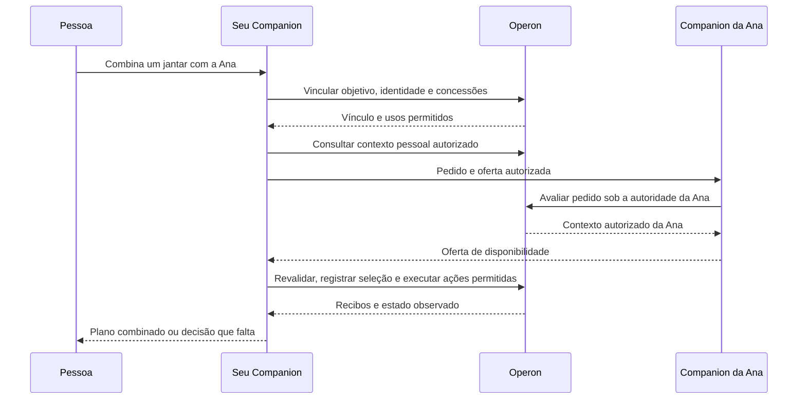

Companion + Operon — experiência, memória, ontologia e IBAC

Especificação proposta, versão 0.4 — 12 de setembro de 2026.

Marca pública atual: **Zoen**, anteriormente Companion. As referências a Companion neste documento descrevem o mesmo produto. O site usa o mascote fornecido pelo fundador no logo, favicon e avatares dos mockups; o bot selecionado no Telegram é `@TryZoenBot`.

Este documento consolida o funcionamento pretendido para pessoas, grupos e negócios. Ele se apoia no código atualizado de Companion `020d4a5`, Operon `a68ab8b` e no recorte de integração de e-mail `b316bce`. Os comportamentos propostos devem ser implementados e avaliados; os cenários de aceitação associados descrevem resultados esperados.

**A experiência comum.** A pessoa explica o que precisa resolver. Companion entende o pedido, encontra o contexto, organiza o que falta como AI FDE e acompanha o resultado. Operon conserva dados, memória, ontologia, permissões e registros de execução. Uma pessoa pode transitar entre seu espaço pessoal, a família, a faculdade e uma empresa com a mesma identidade, mantendo separadas as informações e as finalidades de cada espaço.

**A promessa de produto.** Um Companion que lembra, organiza, resolve e coordena com as pessoas importantes da sua vida. A landing apresenta essa experiência desejada, conforme a direção do fundador. O acompanhamento de engenharia distingue cada promessa das capacidades já implementadas e mantém critérios de aceitação para fechar a diferença.

**Começar em um clique; assinatura depois.** A aquisição não tem página pública de preços, seleção de plano, formulário, login web ou cartão antes do primeiro pedido. Os três ícones de 44 px abrem diretamente o mensageiro configurado. O botão principal abre um seletor na própria página, com apenas WhatsApp, Telegram e iMessage: uma folha pela parte inferior no celular e um cartão centralizado no desktop. A primeira mensagem privada verificada no WhatsApp ou Telegram continua criando a conta interna e o espaço pessoal. Abrir o chat não envia automaticamente uma mensagem. A ausência de configuração mostra indisponibilidade e nunca um número inventado.

O botão de iMessage abre o app Mensagens pelo esquema `sms:` com o número Linq configurado, conforme a [documentação da Apple](https://developer.apple.com/library/archive/featuredarticles/iPhoneURLScheme_Reference/SMSLinks/SMSLinks.html). O transporte atual ainda exige um telefone já verificado; criar a primeira conta pelo iMessage permanece uma etapa de implementação e qualificação. A abertura do app não garante que a entrega use iMessage.

Quando uma assinatura fizer sentido, o Companion oferece um link do Stripe na conversa privada já existente. A pessoa vê o valor e a recorrência antes de confirmar. A oferta deve usar o catálogo e os Price IDs realmente configurados, vinculados à pessoa ou organização cuja cobrança ela pode administrar. O agente não recebe um campo arbitrário para assumir outra conta. Ofertas automáticas, limite inicial e momento de apresentar a assinatura ainda precisam de política de produto e qualificação; não introduzir mensagens insistentes ou interromper trabalho aceito sem explicar o estado.

O webhook validado do Stripe é a autoridade para atualizar o direito de uso. Abrir o link, voltar à página de sucesso ou dizer “paguei” não bastam. Cancelamento, expiração, repetição de eventos e pagamento inconclusivo conservam o estado correto e a tarefa em andamento. O serviço de Checkout e a gestão em Conta já existem no Companion; esta entrega muda a entrada pública e reaproveita essa base, sem declarar envio automático de links ou uma cobrança real já qualificados.

**Referências principais e decisões que extraímos delas.** O arquivo fornecido, _The Palantir Impact: Ontology Strategy Connecting Data and AI_, orienta a visão de AI FDE e a conexão entre objetos, relações e ações. O livro de Bailing Zhang, _Operational Ontology: From Business Mirror to Decision Runtime_, orienta o contrato de execução e a separação de responsabilidades. Ambos são referências para o desenho; as decisões abaixo são adaptações propostas para Companion + Operon.

| Referência                                              | Decisão para o produto                                                                                                      | Critério de implementação                                                                                                  |
| ------------------------------------------------------- | --------------------------------------------------------------------------------------------------------------------------- | -------------------------------------------------------------------------------------------------------------------------- |
| Livro, capítulos 3 e 9: dados, lógica, ação e segurança | Operon representa o contexto e governa as ações; cada leitura, transformação e efeito passa por uma verificação pertinente. | Um endpoint ou uma resposta de chat não oferece uma saída paralela aos controles.                                          |
| Livro, capítulo 11: acesso Consumer e Builder           | O mesmo Companion desempenha trabalho de usuário e de FDE com concessões e contextos distintos.                             | Uma sessão de construção não pode alterar sua própria autoridade nem usar uma mudança de schema para obter dados privados. |
| Livro, capítulo 7: tempo e proveniência                 | Originais, versões, transformações e fatos admitidos têm identidade e relação verificável.                                  | Uma decisão pode ser explicada com as fontes e regras vigentes quando foi tomada.                                          |
| Livro, capítulo 10: decisão e correção como objetos     | Decisões, recusas, mudanças humanas e resultados entram no registro operacional.                                            | “Não era isso” aponta para o que mudou e pode melhorar a próxima execução.                                                 |
| Livro, capítulo 15: começar pela decisão                | Cada modelo de domínio nasce de um trabalho que a pessoa quer concluir.                                                     | Toda entidade ou relação nova explica qual tarefa, consulta ou ação atende.                                                |
| Arquivo _The Palantir Impact_: AI FDE e propostas       | O Companion organiza o material usando ferramentas do backend e prepara mudanças inspecionáveis.                            | O original permanece conservado; publicar uma interpretação segue a política de admissão.                                  |

Fontes: [arquitetura](https://github.com/aussie-bzhang/operational-ontology-book/blob/main/chapters/chapter03_overall_architecture.tex), [tempo e proveniência](https://github.com/aussie-bzhang/operational-ontology-book/blob/main/chapters/chapter07_time_version_and_provenance.tex), [governança e decisão](https://github.com/aussie-bzhang/operational-ontology-book/blob/main/chapters/chapter10_security_governance_audit.tex), [agentes](https://github.com/aussie-bzhang/operational-ontology-book/blob/main/chapters/chapter11_ontology_and_llm_agents.tex), [método de implementação](https://github.com/aussie-bzhang/operational-ontology-book/blob/main/chapters/chapter15_implementation_method.tex). O arquivo local foi lido como referência fornecida pelo usuário; afirmações promocionais nele não são garantias de segurança ou desempenho do nosso produto.

O livro atribui a permissão final ao validador determinístico. Nossa proposta de IBAC acrescenta julgamento semântico do modelo sobre a adequação do conteúdo à finalidade concedida. A adaptação precisa ser explícita: o modelo interpreta e seleciona a divulgação; o runtime aplica identidade, concessão, destino, versões, expiração e vínculo com a saída aprovada. Esses controles não demonstram sozinhos que toda interpretação do modelo está correta. Essa qualidade será medida pelas avaliações de IBAC.

**Como os públicos usam a mesma base.** O mercado muda os modelos de domínio, as fontes e as concessões. A execução continua baseada em pessoas, espaços, objetivos, evidências, objetos e ações.

| Público                         | Primeiro resultado útil                                                   | Registro operacional                                                               | Compartilhamento típico                                                                                     |
| ------------------------------- | ------------------------------------------------------------------------- | ---------------------------------------------------------------------------------- | ----------------------------------------------------------------------------------------------------------- |
| Pessoa                          | Recuperar um documento, organizar compromissos e acompanhar uma pendência | Documentos, pessoas, preferências, tarefas e compromissos                          | Pessoal por padrão; compartilhar um resultado específico quando necessário.                                 |
| Família ou amigos               | Encontrar um horário, coordenar uma viagem ou organizar tarefas da casa   | Eventos, participantes, tarefas e despesas compartilhadas                          | Usar informações pessoais apenas para as finalidades concedidas; publicar os recortes pertinentes ao grupo. |
| Faculdade                       | Organizar entregas, referências e responsabilidades de um trabalho        | Projeto, documento, prazo, tarefa e responsável                                    | Material do projeto e andamento; notas e informações pessoais têm concessões próprias.                      |
| Profissional ou negócio sem ERP | Organizar clientes, pedidos, serviços e prazos a partir do que já utiliza | Operon mantém o estado operacional nativo                                          | Separar proprietário, equipe e conversas de cada cliente; divulgar o necessário para cada trabalho.         |
| PME com sistemas                | Responder sobre pedidos, pendências, estoque e execução                   | Operon relaciona as fontes; o sistema designado continua sendo autoridade por dado | Espaços por finalidade, como operação, financeiro ou atendimento de um cliente.                             |

Um grupo é um canal de um espaço. A identidade de quem escreveu, o dono dos dados, o responsável pela tarefa e o público que receberá a resposta são elementos distintos. Ser administrador do grupo permite administrar aquele canal conforme sua concessão; funções financeiras ou acesso a contas pessoais dependem de autoridade própria.

**O que aprendemos com a Glen.** A Glen descreve memória persistente acessível por MCP, com recuperação de contexto e registro de novos aprendizados no mesmo ciclo de interação. O conhecimento é compartilhado no escopo da organização e pode ser usado por agentes de frameworks diferentes. Essa é a referência para o Operon servir memória ao Companion e a outros clientes autorizados. [Fonte: memória para agentes](https://tryglen.com/memory-for/ai-agents).

A página pública também descreve captura contínua, recuperação de trabalho anterior, procedimentos transformados em skills e controle de acesso por observação durante a recuperação. Declara isolamento organizacional no banco, modo privado e integrações voltadas a material público dentro da organização, como canais públicos e transcrições compartilhadas. O nosso produto acrescenta espaços pessoais e grupos com audiências mistas, exigindo concessões de uso e divulgação mais explícitas. Essas descrições são declarações da Glen; não constituem inspeção de sua implementação. [Fonte: produto e perguntas frequentes](https://www.tryglen.com/).

O benchmark publicado pela Glen usa reexecução de trabalho com memória restaurada ao instante anterior à tarefa original. Para nossa avaliação, a lição é comparar tarefas com e sem memória usando somente informação disponível naquele momento. Isso evita avaliar uma resposta com conhecimento que só surgiu depois. Resultados publicados pela empresa não são uma previsão de desempenho do Companion. [Fonte: metodologia do benchmark](https://www.tryglen.com/blog/replaying-100-prs).

**Do arquivo à ontologia operacional.** Existem dois níveis relacionados de modelagem. O primeiro organiza as fontes: documento, versão, trecho, conversa e observação. O segundo representa o domínio: cliente, pedido, compromisso, pagamento ou equipamento. Um documento pode ser localizado e utilizado antes de terminar toda a extração de seu conteúdo.

| Etapa          | O que o Operon conserva                                                            | Resultado disponível                                                 |
| -------------- | ---------------------------------------------------------------------------------- | -------------------------------------------------------------------- |
| 1. Receber     | Conteúdo bruto, referência ao arquivo, origem, versão, escopo e usos permitidos    | A entrada tem identidade e pode ser retomada.                        |
| 2. Registrar   | Documento e versão ligados à conexão, pessoa ou espaço de origem                   | O documento já é um objeto localizável na camada de conhecimento.    |
| 3. Indexar     | Texto extraído, trechos com localização, índices textuais e semânticos autorizados | Busca com referência ao documento e à passagem pertinente.           |
| 4. Interpretar | Observações e candidatos a fatos/relações, com evidência e incertezas              | Respostas fundamentadas no que a fonte afirma e dúvidas localizadas. |
| 5. Relacionar  | Correspondências com entidades existentes, conflitos e mapeamentos versionados     | O mesmo cliente ou compromisso pode ser reconhecido entre fontes.    |
| 6. Admitir     | Objetos e relações que passaram pelas regras de admissão                           | Estado operacional utilizável por ações registradas.                 |
| 7. Aprender    | Memórias, correções e procedimentos derivados do trabalho observado                | As próximas interações começam com contexto pertinente.              |

A ontologia fornece identidade, significado e relações. O armazenamento de arquivos conserva os bytes; os índices aceleram a busca. As referências unem essas partes. Essa separação também aparece na documentação da Palantir para documentos: trechos podem ser associados a objetos e ligados ao documento original. [Fonte: processamento de documentos](https://www.palantir.com/docs/foundry/ontology/document-processing).

Exemplo: um contrato entra como documento com versão e partes identificadas. A busca já encontra a cláusula de entrega. Depois, o FDE propõe cliente, pedido, prazo e obrigação, vinculados à cláusula. Uma nova versão do contrato reavalia essas interpretações. O pedido passa a usar o prazo atualizado somente pelo caminho de mudança admitido, preservando a relação com a versão que o fundamentou.

O FDE parte de modelos pequenos e reutilizáveis. Normalização de formato, identidade de entidades e interpretação de significado têm verificações distintas. Uma referência parecida pode gerar uma correspondência candidata; um campo vazio continua desconhecido. Uma declaração “paguei” é registrada como declaração da pessoa, enquanto a confirmação de recebimento segue a fonte definida para esse estado.

**Memória como ferramenta do agente.** O ciclo tem captura confiável e interpretação seletiva. O runtime registra eventos observáveis autorizados, como mensagens recebidas, ferramentas executadas, decisões e resultados. O agente identifica preferências, correções, decisões de trabalho e procedimentos que merecem memória durável. Esses registros apontam para a evidência original e recebem escopo, validade e condições de uso.

| Conteúdo                        | Exemplo                                                                      | Como volta para o agente                                                   |
| ------------------------------- | ---------------------------------------------------------------------------- | -------------------------------------------------------------------------- |
| Evidência                       | Trecho do contrato ou mensagem de um participante                            | Trecho pertinente e referência verificável.                                |
| Episódio                        | Uma entrega foi remarcada e depois concluída                                 | Resumo do acontecimento, envolvidos e resultado observado.                 |
| Preferência ou regra contextual | A pessoa prefere manhãs; o negócio confirma pedidos após determinada entrada | Contexto aplicável à tarefa, com origem e correções.                       |
| Procedimento                    | Como preparar o fechamento semanal daquela equipe                            | Skill ou receita versionada quando o procedimento estiver qualificado.     |
| Estado operacional              | Pedido confirmado, prazo vigente, responsável e recibo                       | Consulta aos objetos e relações atuais, respeitando a fonte de autoridade. |

Ao começar uma tarefa, Companion pede contexto ao Operon com a identidade e a finalidade vinculadas pelo servidor. Durante o trabalho, consulta evidências adicionais. Ao aprender ou corrigir algo, chama a ferramenta de memória. Ao concluir, o runtime registra o efeito realmente observado. Um envelope pode reunir leitura e registro numa mesma viagem de rede; cada uso conserva autorização, resultado e idempotência próprios.

Uma memória sintetizada herda as restrições das evidências usadas. Publicar uma projeção menos detalhada exige uma decisão de divulgação apropriada. Repetir a própria resposta do agente não acrescenta uma fonte independente. Uma preferência lembrada orienta o trabalho; concessões continuam sendo registros de autoridade emitidos pelo servidor.

Correção, mudança de fonte, expiração, revogação e esquecimento precisam alcançar memórias derivadas, trechos, índices, caches e próximas recuperações. Uma fonte externa continua sujeita ao seu próprio ciclo de vida. Registros de execução conservam apenas a informação necessária às suas obrigações. Uma revogação impede usos futuros controlados pelo produto; mensagens já recebidas por pessoas podem ter cópias fora dele.

**IBAC: o modelo julga finalidade, necessidade e divulgação.** Neste produto, IBAC significa decidir o uso da informação à luz da finalidade autorizada e do contexto atual. Há duas intenções a considerar: o objetivo que o dono dos dados permitiu ao delegar e o objetivo do pedido que chegou agora. A intenção de quem pede não concede poder sobre os dados de outra pessoa.

O modelo tem um papel substantivo: interpretar o pedido, selecionar os fatos necessários, reconhecer informação excedente, escolher uma projeção e formular a resposta apropriada. O Operon vincula essa avaliação à concessão vigente, ao público e ao conteúdo efetivo da entrega. Isso permite decisões contextuais sem exigir que o cliente configure permissões por coluna.

Uma concessão pode nascer de linguagem comum: “Use minha agenda para combinar horários com a família; pode compartilhar minha disponibilidade”. O serviço autorizado registra a finalidade, o recurso, os usos e o público correspondentes. O modelo pode escolher uma janela livre e apresentá-la. A informação sobre o motivo de uma indisponibilidade exige uma concessão que a contemple.

O nome IBAC é usado por abordagens diferentes. O trabalho DePLOI/IBAC-DB estuda traduzir e auditar políticas expressas em linguagem natural. Uma proposta de IBAC para agentes de 2026 separa interpretação de intenção e aplicação das permissões nas ferramentas; reconhece limitações de interpretação e de controle dos argumentos, incluindo o corpo de mensagens. Para o nosso caso, o conteúdo divulgado precisa fazer parte da decisão. [DePLOI](https://arxiv.org/abs/2402.07332), [IBAC para agentes](https://ibac.dev/ibac-paper.pdf).

**Contrato de uma decisão de uso e divulgação.**

| Entrada da avaliação                              | Responsabilidade                                                                               |
| ------------------------------------------------- | ---------------------------------------------------------------------------------------------- |
| Pessoa autenticada, espaço e participantes atuais | Identificar o solicitante e o público real, a partir do canal e dos registros de identidade.   |
| Pedido e contexto conversacional pertinente       | Interpretar finalidade, referências e a tarefa a que uma resposta curta se aplica.             |
| Mandato e concessão do dono dos dados             | Delimitar recursos, operações, finalidade, processadores, públicos, validade e orçamento.      |
| Evidências e suas condições de uso                | Examinar apenas o conteúdo autorizado para aquele processamento.                               |
| Projeção ou resposta candidata                    | Julgar necessidade e adequação, abrangendo texto, anexos, nomes de arquivos, citações e links. |
| Revisões da tarefa, política e audiência          | Impedir que uma decisão antiga autorize uma entrega que mudou.                                 |

O resultado mantém a álgebra do Operon: `ALLOW`, `DENY`, `REVIEW_REQUIRED` ou `EVIDENCE_INSUFFICIENT`. Um resultado `ALLOW` pode autorizar uma projeção específica. Aprovar uma projeção não aprova o documento inteiro. Falha de infraestrutura permanece um resultado técnico separado.

A decisão registra finalidade normalizada, concessão e política utilizadas, referências às evidências, projeção permitida, destino, validade, identidade do avaliador e uma justificativa curta. A entrega fica vinculada ao conteúdo exato por digest. Confiança numérica do modelo não amplia a concessão. Limites verificáveis são aplicados pelo Operon; a qualidade do julgamento semântico precisa ser medida em casos representativos e adversariais.

**Como usar dados privados ao responder num grupo.** O raciocínio sobre a fonte privada acontece em uma execução autorizada para aquela fonte, separada do contexto conversacional do grupo. Ela retorna uma projeção apropriada à finalidade, como disponibilidade. O contexto compartilhado recebe essa projeção quando sua publicação foi autorizada. Esse desenho estende o acesso por finalidade preservando a separação de memória pessoal prevista no ADR G02.

A avaliação semântica deve usar o pedido vinculado à identidade, a concessão e as evidências identificadas como dados. Um documento, uma memória ou uma mensagem encaminhada não pode alterar instruções de autorização. O papel de avaliação não recebe ferramentas para modificar suas próprias concessões. A entrega revalida destino, participantes, revogação e versão da tarefa, e usa a mesma saída aprovada. Texto gerado a partir de informação privada não é transmitido ao grupo antes desse ponto.

Se uma pessoa pedir um dado fora do que foi concedido, o Companion pode responder com uma alternativa suficiente, pedir autorização ao dono no canal apropriado ou recusar aquela divulgação. A explicação pública deve evitar expor o próprio fato protegido. O histórico privado de decisão pode conservar uma justificativa mais detalhada para o responsável autorizado.

**Invocação em grupos.** A regra inicial aproveita o comportamento já implementado: menção explícita ao assistente ou resposta a uma mensagem dele. Uma solicitação recorrente autorizada pode gerar uma atualização vinculada àquela tarefa. O restante da conversa não inicia trabalho automaticamente.

| Situação                                        | Comportamento proposto                                                                                                                      |
| ----------------------------------------------- | ------------------------------------------------------------------------------------------------------------------------------------------- |
| Alguém menciona o Companion                     | Resolver identidade, finalidade, contexto pertinente e permissões antes de agir.                                                            |
| Alguém responde à pergunta do Companion         | Associar a resposta à tarefa e à revisão corretas; verificar se a pessoa pode contribuir ou decidir.                                        |
| “Sim” sem referência clara entre duas tarefas   | Pedir uma desambiguação curta, conservando as propostas pendentes.                                                                          |
| Conversa comum                                  | Permanecer em silêncio; capturar contexto apenas se houver uma política de captura autorizada para o grupo.                                 |
| Observação contínua habilitada                  | Processar somente o contexto coberto pela concessão; decidir separadamente se uma resposta pública é necessária.                            |
| Novo participante ou remoção                    | Atualizar o público e reavaliar consultas, trabalhos pendentes e mensagens ainda não entregues.                                             |
| Participante sem conta vinculada                | Responder sobre conteúdo público ou fornecido na interação quando permitido; vincular identidade quando uma operação exigir acesso pessoal. |
| Pedido por dados privados de outro participante | Usar apenas as finalidades que o dono concedeu; buscar autorização privada quando necessária.                                               |

Capturar contexto e responder são decisões separadas. O modo inicial guarda interações dirigidas ao assistente e fontes fornecidas para a tarefa. A captura contínua exige uma concessão apropriada e informação clara aos participantes. Cada canal só pode oferecer modos compatíveis com o que o provedor realmente entrega; uma mensagem recebida pela API não representa autorização geral para guardar ou reutilizar tudo.

Trabalhos diferentes dentro de um grupo recebem identidades próprias. A pessoa mantém o controle por linguagem comum: “pare”, “o que falta?”, “é sobre o outro pedido”, “esqueça essa preferência”. A passagem para uma conversa privada preserva a tarefa e retorna ao grupo somente com o resultado autorizado. Conectar uma conta retoma o pedido original. Cancelamento e correções invalidam propostas antigas e acompanham o trabalho em andamento.

**Registro de uma resposta é parte da operação.** Toda publicação com conteúdo do Operon passa pelo mesmo contrato de uso, inclusive a mensagem final comum do assistente. O registro liga pedido, intenção, dados consultados, decisão de divulgação, conteúdo entregue e recibo do canal. Pré-visualizações de links, arquivos e citações seguem as mesmas condições. Autorização para conversar num grupo não autoriza publicar qualquer conteúdo nele.

**Rede de pessoas de confiança.** A referência funcional é o anúncio de Instinct fornecido na conversa. Adotamos a capacidade descrita, sem inferir como o protocolo proprietário foi implementado ou seu estado atual de distribuição. Cada pessoa mantém seu Companion. A rede permite que esses assistentes coordenem objetivos específicos entre participantes que aceitaram essa relação.

Um vínculo de confiança permite chegar à outra pessoa, mas seus usos são concedidos separadamente. Confiar em Ana para combinar encontros não dá acesso à agenda completa dela, aos contatos dela ou aos documentos de sua empresa. Uma relação profissional pode permitir negociar um horário de atendimento sem revelar a carteira de clientes do negócio. Participar da rede pessoal não transfere permissões de uma organização.

O primeiro produto usa uma rede dentro do próprio serviço. A identidade do remetente vem do servidor e a entrega é autenticada entre os contextos dos participantes. Um protocolo entre instalações independentes pode usar o mesmo contrato depois, acrescentando registro de emissores, autenticação de serviço, rotação e revogação de chaves. Isso evita começar com descoberta pública de agentes ou federação aberta antes de provar a experiência.

| Registro                   | Conteúdo mínimo                                                                                             | Dono do estado                                                               |
| -------------------------- | ----------------------------------------------------------------------------------------------------------- | ---------------------------------------------------------------------------- |
| Identidade de participante | Pessoa autenticada, representação do agente, canais vinculados e espaço em que age                          | Fronteira de identidade do Companion; referência estável no Operon.          |
| Vínculo de confiança       | Duas identidades, convite, aceite de cada lado, estado, revisão e revogação                                 | Operon; alterações entram pelo caminho de ação autorizado.                   |
| Concessão por direção      | Objetivos permitidos, recursos, projeções, ações, destinatários, validade e limites                         | Operon, emitida pelo responsável; pode ser diferente em cada sentido.        |
| Coordenação                | Objetivo, iniciador, participantes explícitos, prazo de resposta, revisão e estado                          | Operon; Eve acompanha o trabalho durável.                                    |
| Oferta de participação     | Horários ou condições autorizadas, validade, revisão da coordenação e referência privada à evidência        | Contexto do participante; somente a projeção autorizada chega à coordenação. |
| Mensagem de protocolo      | Emissor, destinatário, coordenação, tipo, revisão, identificador idempotente, validade e conteúdo permitido | Caixa de saída/entrada durável, com registros de entrega.                    |
| Compromisso e efeito       | Seleção aceita, autoridade para execução, recibos de cada integração e pendências                           | Operon; ferramentas executam cada efeito sob a autoridade pertinente.        |

Esses são conceitos de domínio, não uma instrução para criar sete serviços ou duplicar os schemas existentes. Devem reutilizar identidade, mandato, concessão, ações e registros de execução atuais. O protocolo recebe nomes definitivos somente ao conectar seus produtores e consumidores.

**Fluxo: “combina um jantar com a Ana na sexta”.**

1. O Companion resolve qual Ana, verifica o vínculo aceito e registra o objetivo. Se a pessoa já delegou coordenação dentro desses limites, começa o trabalho. Ambiguidade de identidade exige uma pergunta curta.
2. O Companion da pessoa lê sua agenda e preferências sob suas próprias concessões. Produz uma oferta de horários. Nomes de compromissos, endereços e motivos de indisponibilidade ficam nesse contexto privado.
3. A mensagem enviada ao Companion da Ana contém o objetivo, a janela de datas, a duração desejada e os detalhes autorizados. O recebimento não concede ao remetente acesso aos dados da Ana.
4. O Companion da Ana valida a relação e o pedido e considera as concessões dela. Consulta o contexto autorizado e responde com disponibilidade, uma contraproposta ou a necessidade de uma escolha da Ana. A resposta também passa por IBAC.
5. A coordenação seleciona uma opção compatível e revalida a atualidade das ofertas. Reservar ou criar um evento exige a autoridade correspondente de cada participante. Uma autorização para sugerir horários não equivale a uma autorização para ocupar a agenda.
6. As gravações são executadas com identificadores idempotentes e recibos. A conclusão descreve o que foi observado. Se uma agenda foi atualizada e outra falhou, o estado continua parcialmente aplicado e o trabalho reconcilia ou compensa o efeito conforme sua política.
7. Uma mudança de plano cria nova revisão. Ofertas e confirmações antigas não autorizam a nova proposta. O Companion retoma a combinação sem pedir que a pessoa reconte todo o histórico.

Se a tarefa ocorre dentro de um grupo, a invocação usa menção ou resposta vinculada ao Companion. A resposta ao grupo contém a disponibilidade ou o plano autorizado. O grupo não vira uma conta com acesso às memórias individuais. Na coordenação entre assistentes, os participantes podem resolver o plano sem pertencer a um grupo comum de WhatsApp.

O diagrama mostra dois contextos independentes usando Operon; nenhuma chamada de um participante herda as credenciais ou a sessão do outro. A mensagem entre agentes é dado de uma tarefa e nunca uma instrução de sistema, uma concessão ou uma autorização de administrador.

**Tipos de mensagem e transições.** O contrato precisa cobrir convite/aceite/revogação do vínculo e pedido/oferta/seleção/confirmação/alteração/cancelamento/recibo da coordenação. Cada recebimento valida o emissor, o destinatário, o vínculo, a concessão, a revisão da tarefa e a validade. Duplicatas devolvem o resultado registrado. Replays e mensagens fora de ordem não repetem efeitos nem restauram revisões anteriores.

Uma coordenação atravessa estados que distinguem coleta de respostas, proposta, decisão pendente, execução, aplicação parcial, conclusão e cancelamento. O estado da coordenação e o estado do transporte são distintos. Receber uma mensagem, aceitar participar e aplicar um evento são três acontecimentos diferentes.

Para encontros recorrentes, a concessão descreve os limites da série. Cada ocorrência revalida participantes, revogações e disponibilidade. Alterar o objetivo, incluir uma nova pessoa ou ultrapassar os limites concedidos requer uma nova decisão do responsável. Para dezenas ou centenas de convidados, a coleta usa fan-out limitado, prazo e resposta por participante; não produz uma conversa de todos com todos nem exige que todos entrem numa rede transitiva. O organizador vê os recortes que cada pessoa autorizou para aquele evento.

A tarefa mantém limites de frequência e de detalhamento para consultas de disponibilidade. Uma sequência de perguntas não pode ampliar progressivamente o recorte que foi concedido. Convites e recusas evitam expor dados ou confirmar vínculos privados a terceiros. A revogação impede novos usos e reavalia trabalho pendente; ela não promete recolher informação já recebida fora do sistema.

**Primeira prova completa da rede.** Duas contas reais no ambiente de teste aceitam o vínculo. Cada uma autoriza somente disponibilidade para um jantar, mantendo um compromisso privado na fonte. Uma pessoa pede a coordenação. Os assistentes encontram uma opção, revalidam uma alteração de agenda, concluem apenas os efeitos delegados e permitem retomar a tarefa após reinício. Nem o outro assistente nem o grupo recebem o compromisso privado. A mesma prova inclui revogação antes da entrega, duplicata de mensagem, convite não aceito e falha em uma das gravações.

Essa implementação vem depois da ponte autenticada, da persistência e da publicação governada descritas adiante. O recurso inteiro ainda depende dessas ligações; os exemplos da landing comunicam a visão de produto e não constituem testes do protocolo.

O usuário vê informações úteis: “Consigo sugerir horários usando as agendas autorizadas”, “A entrega mudou para quinta-feira” ou “Ainda estou conferindo se a atualização foi aplicada”. Ferramentas, candidatos e etapas de modelagem permanecem nas interfaces internas. Um pedido de autorização mostra destinatário, conteúdo ou consequência pertinente e acontece somente quando falta uma decisão do responsável.

**Conexões criadas na conversa, inspiradas no relato do Muse.** A referência fornecida pelo fundador descreve um assistente que escreve uma integração e a executa no ambiente de trabalho compartilhado na nuvem. Adotamos essa experiência como requisito de produto: “conecta o sistema da minha loja e me avisa dos pedidos atrasados” deve iniciar o trabalho, sem exigir que o cliente escolha um SDK, escreva código ou modele a ontologia. O trecho fornecido é a fonte dessa inspiração; não constitui uma verificação independente da implementação ou cobertura atual do Muse.

O Companion começa pelo objetivo e reutiliza uma conexão qualificada quando houver uma. Consulta primeiro os catálogos aplicáveis do Eve e os sources do gateway. Para um serviço novo, o papel Builder inspeciona a documentação autorizada, preferencialmente OpenAPI, GraphQL ou MCP, e prepara um adaptador com autenticação, escopos, operações, paginação, limites, transformação e testes. Descobrir uma integração não concede acesso à conta. O usuário só precisa participar para identificar um serviço ambíguo, conectar sua conta ou decidir um acesso ou efeito que ainda não delegou.

O artefato da conexão tem proprietário, versão, digest do código, operações permitidas, destinos de rede, contrato de entrada e saída, dependências e evidências de qualificação. Credenciais ficam em um broker do backend, referenciadas por identidade e serviço; não são embutidas no código, no prompt, nos logs ou em uma skill reutilizável. A reutilização de um adaptador por outra pessoa reutiliza o código qualificado e exige uma concessão e credenciais próprias. Compartilhar um adaptador não compartilha a conta de quem o criou.

**Responsabilidades do caminho de construção e execução.** Eve mantém o trabalho durável de criação, testes, espera de autenticação, correção e retomada. O Companion raciocina como FDE e conversa com a pessoa. Operon conserva os artefatos, fontes, concessões, versões e resultados. O gateway baseado em Executor executa as operações aprovadas. Um ambiente isolado de construção pode compilar e testar o adaptador quando a superfície QuickJS do gateway não for suficiente; ele é um recurso de execução do trabalho existente, não outro agente principal, scheduler ou fonte de autoridade. Não é necessário criar uma VM permanente por usuário para oferecer a experiência de um ambiente compartilhado.

A primeira qualificação usa fixtures e leituras pequenas autorizadas, incluindo erro, paginação, autenticação expirada e limites do provedor. Uma conexão entra em uso somente depois de seu contrato e seu caminho real estarem verificados. Escritas são ações governadas com preparo, revalidação, execução idempotente quando suportada e verificação no provedor. Um teste que devolve sucesso não autoriza a mudança de escopo, e uma escrita de resultado incerto permanece pendente de reconciliação. Código e documentação recebidos de uma API são material a examinar, nunca instruções superiores ou permissão para instalar dependências e acessar novos destinos livremente.

Os dados recebidos entram no mesmo caminho progressivo de ingestão: preservar original e versão, indexar o que já é útil, propor entidades e relações quando isso atende ao objetivo e publicar segundo a política vigente. Criar um conector não exige criar um modelo de domínio inteiro antes da primeira consulta. O consumidor recebe a operação e os dados permitidos; não recebe automaticamente a capacidade Builder que produziu a conexão.

Mudanças no contrato do provedor abrem uma nova revisão do artefato. O FDE pode reparar a conexão em segundo plano dentro das concessões existentes, validar e publicar conforme a política, mantendo a versão anterior recuperável. Uma nova permissão, destino ou consequência exige avaliação própria. A conversa fica silenciosa enquanto o trabalho segue normalmente e informa prontidão, resultado, falha relevante ou uma decisão que dependa da pessoa. Interromper ou revogar a conexão bloqueia novas execuções, inclusive trabalhos que estavam aguardando.

**Primeira prova dessa experiência.** Uma pessoa pede acesso a um serviço de demonstração real com OpenAPI e uma conta isolada. O Companion verifica que não existe adaptador qualificado, cria uma versão de leitura, pede a conexão da conta, valida uma consulta paginada e entrega o resumo pedido com origem no Operon. O teste reinicia o processo durante a construção, tenta reutilizar a conexão em uma segunda conta e simula mudança da API. A retomada conserva o trabalho; a segunda conta não herda credenciais; o reparo não amplia os acessos. A implementação vem após a ponte, a persistência e a execução governada. A landing já comunica essa direção, enquanto estes cenários qualificam a entrega futura.

**Interfaces existentes e extensões necessárias.**

| Peça                    | Base atual verificada                                                                                                                    | Evolução proposta                                                                                                                                                |
| ----------------------- | ---------------------------------------------------------------------------------------------------------------------------------------- | ---------------------------------------------------------------------------------------------------------------------------------------------------------------- |
| Ingestão e modelagem    | `operon_ingest_source`, `operon_get_source`, `operon_propose_mapping`, revisão/admissão e busca em quarentena                            | Referências duráveis a arquivos, extração de documentos, trechos, índices e transformações com proveniência.                                                     |
| Memória                 | `GovernedMemoryService` oferece registro e recuperação; implementação usa mapas em memória                                               | Persistência, fontes e validade das memórias, autorização por uso e ferramentas de recuperação/registro/correção para o Companion.                               |
| Intenção e autoridade   | `TaskMandate`, `IntentGrant`, `UseGrant` e `evaluateAuthority`                                                                           | Ligar a intenção da conversa à avaliação semântica e aos checkpoints de uso e publicação.                                                                        |
| Avaliador de autoridade | Há verificações de recurso, ação, audiência, finalidade e atualidade em `authority-evaluator.ts`; a finalidade usa comparação de strings | Normalizar a finalidade com evidência do pedido autorizado e verificar o conteúdo proposto, sem tratar um nome de finalidade como prova suficiente de adequação. |
| AI FDE                  | `AIFdeAgent`, catálogo de manifests e recipes                                                                                            | Instruções efetivas, ciclo de inspeção/modelagem/transformação/avaliação e uso das correções.                                                                    |
| Grupo                   | `evaluateGroupMentionPolicy`, identidade do remetente e escopo da conversa                                                               | Persistência de participantes, memória coletiva, concessões, tarefas concorrentes e entrega com reavaliação da audiência.                                        |
| Publicação              | Ações governadas e infraestrutura de entrega já fornecem peças                                                                           | Tratar resposta e anexos como uma publicação preparada e registrada, evitando um caminho de saída sem controle.                                                  |

As novas capacidades de memória podem ser expostas por operações de recuperar contexto, registrar aprendizado e corrigir/esquecer. Documentos devem aproveitar a fronteira de ingestão. A divulgação pode ser uma ação registrada de comunicação que utiliza a preparação, decisão, commit e entrega existentes. Os nomes finais das ferramentas devem seguir os schemas e os consumidores reais, evitando APIs paralelas para a mesma regra.

O schema atual de memória ainda não representa sozinho todo esse contrato de proveniência e uso. Ter `sensitivity` no registro não demonstra aplicação da sensibilidade em cada recuperação. Da mesma forma, o campo de audiência em uma concessão não demonstra que a resposta do Companion já passa por ele. Essas ligações precisam de testes entre processos e pelo canal de entrega.

**Ordem de implementação atualizada.** A primeira entrega operacional continua sendo a ponte autenticada do PR #60 com o Operon real e a persistência do estado usado. A landing é uma entrega paralela de comunicação da visão. Logo depois da ponte, completar um documento/mensagem real que vira contexto recuperável e aceita correção. O primeiro FDE usa um modelo pequeno e produz uma mudança verificável.

Em seguida, completar a decisão de uso por intenção e uma publicação com projeção, inicialmente numa audiência controlada. O caso de referência é agenda pessoal autorizada para coordenação familiar: encontrar um horário permitido, publicar a disponibilidade e recusar o detalhamento fora da concessão. Só então ampliar o caminho para múltiplos participantes e conectores reais, mantendo os mesmos critérios.

No Companion, os pontos de integração incluem `server/operon`, ferramentas de memória, contexto de sessão, `server/channels/group-policy.ts` e o caminho de entrega. No Operon, incluem os schemas de ingestão, memória e autoridade; `packages/runtime/src/policy/authority-evaluator.ts`; os serviços de ingestão e memória; e as ferramentas MCP. Eve continua proprietário da execução durável do agente. Operon permanece utilizável por outros agentes autorizados.

**Canal e limites da evidência.** A proposta de grupo exige uma prova com o provedor que atenderá o produto. A publicação da Kapso consultada informa não expor uma superfície suportada de Groups API para seus números gerenciados e descreve limitações de elegibilidade. O acesso direto à página da Meta retornou 429 nesta investigação. Portanto, essas condições são atribuídas à Kapso e devem ser verificadas na conta e no modelo de grupo escolhidos. O suporte individual ou um teste no Telegram não comprova operação em grupos existentes de WhatsApp. [Fonte: posição pública da Kapso](https://kapso.com/blog/whatsapp-groups-api-state-2026).

**Aceitação.** O arquivo associado de cenários define resultados esperados para invocação, IBAC, memória, documentos, FDE e execução. É uma especificação de testes, ainda sem resultado de execução do backend. As verificações devem medir concessões indevidas, recusas indevidas, pedidos de esclarecimento, conteúdo excessivo, persistência das correções e conclusão da tarefa. Os casos também devem avaliar anexos e links, alteração de participantes entre preparação e envio, memória contaminada, fonte revisada, falha do avaliador e revogação.

A experiência estará demonstrada quando uma pessoa conseguir delegar, corrigir e retomar o trabalho, e um grupo receber informação suficiente para seu objetivo com as permissões preservadas. A expansão para novos mercados acrescenta modelos, fontes e concessões qualificadas sobre esse mesmo ciclo.

**Referências do código examinado.**

- [Direção de produto](https://github.com/EnzoTironi/OpenInstinct/blob/020d4a5733c7b1151bb64d844f6263d0ab2b3ebc/docs/product-direction.md).
- [Invocação e identidade em grupos](https://github.com/EnzoTironi/OpenInstinct/blob/020d4a5733c7b1151bb64d844f6263d0ab2b3ebc/server/channels/group-policy.ts).
- [ADR G02: separação entre memória pessoal e de grupo](https://github.com/EnzoTironi/OpenInstinct/blob/020d4a5733c7b1151bb64d844f6263d0ab2b3ebc/docs/decisions/adr-g02-groups-memory-policy.md).
- [Contrato S06: intenção e autoridade](https://github.com/EnzoTironi/operon/blob/a68ab8bd2fe0a705e945ed74512d60ec1d90893c/docs/specs/S06.md).
- [Schemas de mandato e concessão](https://github.com/EnzoTironi/operon/blob/a68ab8bd2fe0a705e945ed74512d60ec1d90893c/packages/schema/src/actions.ts).
- [Avaliador de autoridade](https://github.com/EnzoTironi/operon/blob/a68ab8bd2fe0a705e945ed74512d60ec1d90893c/packages/runtime/src/policy/authority-evaluator.ts).
- [Schemas de memória e execução](https://github.com/EnzoTironi/operon/blob/a68ab8bd2fe0a705e945ed74512d60ec1d90893c/packages/schema/src/missions.ts).
- [Serviço de memória](https://github.com/EnzoTironi/operon/blob/a68ab8bd2fe0a705e945ed74512d60ec1d90893c/packages/runtime/src/missions/agent-memory.ts).
- [Ferramentas MCP](https://github.com/EnzoTironi/operon/blob/a68ab8bd2fe0a705e945ed74512d60ec1d90893c/packages/mcp/src/standard-tools.ts).
