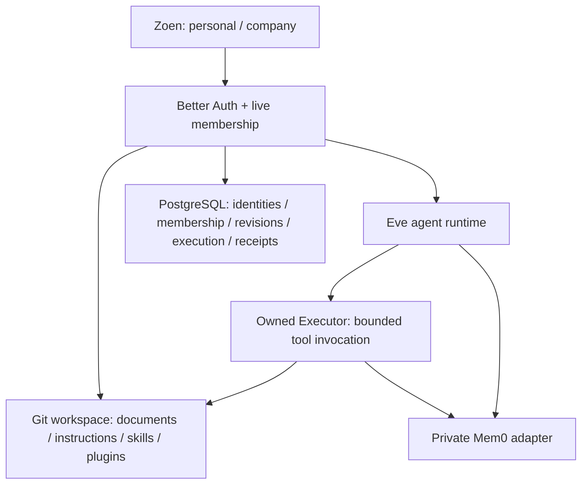

# Zoen + Executor + Mem0 delivery

Date: 2026-09-13. Baseline: `b532432` (application), `cffa8d4` (shared-workspace
architecture). Branch: `codex/zoen-executor-mem0`.

## Implemented product

Zoen now has personal and company spaces in the existing sky interface. The space
switcher opens files, agent instructions, skills, plugins, learned memory, usernames
and team invitations. PT-BR, English and Spanish share the same screens. The home
keeps its five primary actions and the existing 80% bottom sheets.

- Each workspace publishes an actual Git bundle in PostgreSQL. Documents, six
  editable agent instruction files, skills and the approved plugin manifest have
  immutable revisions, history, restore, export and optimistic concurrency.
- AnyDoc converts supported documents in a bounded local child process. Hosted
  OCR is explicitly disabled. Original bytes and their SHA-256 provenance remain
  accessible to authorized workspace members. Invalid/oversized imports fail.
- Eve loads the selected space's published instructions and skills. The owned
  Executor kernel executes short JavaScript/TypeScript with an explicit tool
  catalog. File reads/search and learned-memory retrieval reauthorize every call.
  Agent document writes publish through the same revision check as the editor.
- Mem0 is self-hosted on a private Fly service. Learned facts are private per
  person **and** workspace; shared team knowledge remains in Git. The panel and
  chat can save, recall, edit, forget, pause and clear learned facts.
- A person can claim a unique username, choose directory visibility, create a
  company space and invite an exact handle. Invitations require explicit receipt
  and acceptance. Members can edit team documents; only owners/admins maintain
  agent instructions, skills and plugin permissions. Removal revokes live access
  and schedules deletion of that member's private team memory.

## Boundaries and ownership

Operon is not in the new execution path, Docker image or required CI setup. The
retired adapter and explicitly separate `test:legacy:operon` remain as migration
reference. The owned MIT kernel is pinned to upstream revision
`f1d95f2b657316180992d5a67c24b7b76dc2b0f1`; it is not a fork of the entire Executor
application. Its original tests run with Zoen's tests.

Secrets, sessions, permissions, task state and mutation receipts remain in the
database/secret store. Branches are not privacy boundaries. Documents and custom
instructions grant no new authority. Browser work keeps its existing worker;
root scratch commands use Eve's isolated virtual filesystem with network disabled.
A production bundle resolves QuickJS from the application package root so its WASM
asset and pinned version survive Eve's bundling.

Before an uncertain Mem0 write can occur, PostgreSQL records a pending-operation
fence. Recall fails closed until the current service state is acknowledged.
Forgetting tombstones cached recall records, including on replay. Account/member
removal leaves an erasure outbox; Eve retries deletion every five minutes.

## Verified behavior

- Baseline: 1,225 tests. Current main check: **1,319 passed, 3 skipped, 161 files**;
  TypeScript, lint, formatting and dependency checks pass.
- The built Next/Eve app was exercised in Chromium, not only a development server.
  Compiled import, native tool-schema serialization and QuickJS asset resolution
  bugs found in this pass were fixed before release.
- Actual AnyDoc RTF conversion, exact original download, Git history/restore and
  two simultaneous editors: stale writes return a conflict and preserve the draft.
- Two real synthetic Better Auth sessions: owner invites, guest accepts, guest
  writes a shared document, owner sees it, guest cannot edit the owner's agent
  instructions, and removal makes the old export URL return 403 and the page 404.
- Native chat: a published skill loads, Executor lists/reads both source documents,
  `workspace-save` publishes a new revision, and the user receives the result.
- Native Mem0 chat: save a preference, recall it in a new conversation, forget it,
  then observe an empty memory panel. No test uses an actual person's private data.
- Desktop Spanish and mobile PT-BR/English screens have no horizontal overflow or
  browser JavaScript errors. Opening/closing panels retains client navigation.
- Actual Mem0 SDK with deterministic isolated model fixtures: 4 Python tests.
  Live-provider verification also covered authentication, extraction, semantic
  search, updates, namespace isolation, deletion and persistence after restart.
- PostgreSQL migrations 0000–0036 succeed on an empty database. An upgrade from
  the production 0030 baseline retains a seeded workspace; a second migration run
  is idempotent. Real PostgreSQL integration results are recorded in the release.

The structural review also identified UI complexity/churn and SQL-query shape
similarities. These are advisory maintainability findings, not a claim that the
entire codebase has no debt. Security-boundary tests and explicit domain ownership
are retained rather than hiding the findings behind generic abstractions.

## Release controls

Target: `https://zoen.tironi.xyz`, Fly app `companion-tironi`. Memory:
`zoen-memory-tironi`, private network only. Application readiness now checks the
HTTP Eve health endpoint, so a listening TCP socket alone cannot qualify a release.

Before database changes, snapshots were verified for production PostgreSQL and the
memory volume. Application migrations 0031–0036 are additive and use Drizzle's
journal. The new memory URL/key are staged without rotating existing authentication
or encryption keys. Publish only after the full checks, real database suite,
compiled browser flow and Linux image build pass. Record the deployed image,
migration state and public smoke results in the PR/release receipt.

## Deliberate limits

- Mem0 runs as one writer on an encrypted volume with snapshots. Restart recovery
  is verified; high availability and a full snapshot restore drill are not.
  Extraction/embedding text goes to OpenRouter's configured model providers;
  self-hosted storage does not make those model calls local.
- Existing legacy profile data is preserved; there is no silent bulk migration to
  Mem0. Git deletion removes the current file but retains history. Memory deletion
  can remain in encrypted backups until their retention expires.
- Company Google/messenger credentials, company scheduled jobs and group memory
  sharing are not enabled. Existing personal integrations keep their boundaries.
- The implemented directory identifies people. A public bot directory, Matrix
  homeserver/federation and authenticated A2A endpoints are follow-on work, not
  advertised capabilities of this release.
- The knowledge base supplies revisions, source hashes and explicit ownership for
  future ontology projections. No graph database, ontology reasoning or automatic
  authority inferred from documents is introduced.
